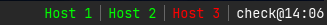

= Checkbar

This tool shows up/warn/down state of configured hosts or applications using i3bar input protocol.

== Usage

You should create a configuration file `.checkbar.toml` in your home directory, e.g.

----
# Update interval in seconds. Default value if not set is 60 sec.
interval = 60

[[checks]]
name = "Host 1"
url = "https://host1.example.com"

[[checks]]
name = "Host 2"
url = "https://host2.example.com"

[[checks]]
name = "App 1"
url = "https://app.example.com/actuator/health"
check_type = "Actuator"
----

Each host or application to be checked consists of `name` and `url`.

You can optionally specify `check_type`:

* `Html`: Default value, checks if a request is successful and returns HTTP OK - 200.
* `Actuator`: Like `Html`, but checks if _Actuator_ shows that the application is up and running.

To use more than one configuration, pass the config file location as first argument to the application.

----
$ checkbar /etc/checkbar_example.toml
----

=== Colors

To change the colors, use the following configuration. As an example the colors of the default configuration are shown.

----
...
[colors]
up = "#00FF00"
warn = "#FFFF00"
down = "#FF0000"
...
----

The color configuration is optional. If used, all colors must be specified.

=== Execute commands

You can also specify a command to be executed when a mouse click occurs on a checked host.
Use `click_cmd` to specify the command to be executed, e.g.

----
...
[[checks]]
name = "Host 1"
url = "http://host1.example.com"
click_cmd = "xterm -e ssh admin@host1.example.com"
...
----
